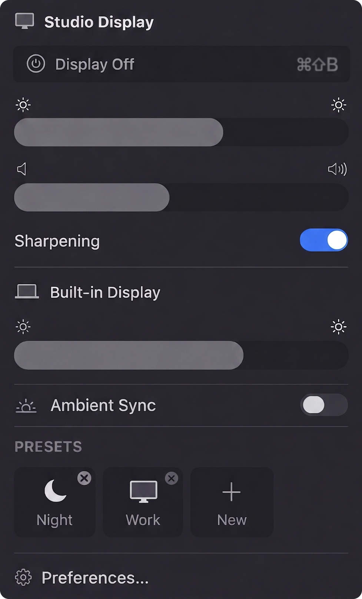

# Cidra

Free, open-source macOS menu bar utility for external monitor control.
Brightness, volume, presets, HiDPI sharpening, BlackOut. No tracking, ever.

**Website:** [cidra-web.vercel.app](https://cidra-web.vercel.app)

<p align="center">
  
</p>

## Install

```bash
brew install sumin220/cidra/cidra
```

Or download the [`.dmg` from Releases](https://github.com/sumin220/cidra/releases) and drag Cidra.app to /Applications.

> **Note:** Unsigned build. macOS will warn about an "unidentified developer" the first time. Right-click Cidra.app → Open, or allow it in System Settings → Privacy & Security.

## Features

- **Brightness control** — DDC/CI for supported monitors, gamma fallback for the rest, DisplayServices for built-in
- **Volume control** — DDC/CI for external monitors with built-in speakers
- **Software dimming** — Drag the slider below 0% to dim past the hardware minimum
- **XDR brightness** — Push built-in displays beyond the SDR 500-nit cap (Apple Silicon)
- **Sharpening** — Adds HiDPI modes to your external monitor for sharper text
- **Presets** — Save and apply brightness/volume combinations across all monitors with one click
- **Auto triggers** — Apply presets automatically based on time of day or app activation
- **BlackOut** — `⌘⇧B` instantly turns off all displays and mutes audio
- **Ambient Light Sync** — Mirror MacBook's ambient brightness to external monitors
- **Keyboard shortcuts** — F1/F2 for brightness, customizable for everything else

## Privacy

No analytics. No tracking. No network calls. No telemetry. Ever.

## Requirements

- macOS 14.0 (Sonoma) or later
- Apple Silicon recommended (DDC/CI requires it)

## Build from source

```bash
brew install xcodegen
xcodegen generate
xcodebuild -scheme Cidra -configuration Release build
```

Open `Cidra.xcodeproj` in Xcode for development.

## License

MIT — see [LICENSE](LICENSE). Pull requests welcome.
